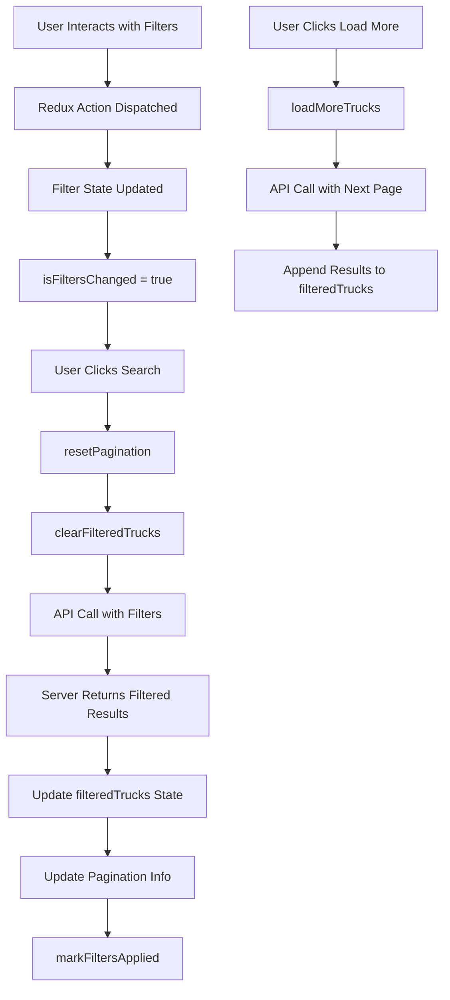

# Filtering and Pagination Guide

## Overview

This guide explains the complete filtering and pagination system implemented for the TravelTrucks application. The system uses **server-side filtering** with MockAPI.io and **client-side state management** with Redux Toolkit.

## Key Concepts

### 1. **Server-Side Filtering**

- Filters are sent as query parameters to MockAPI.io
- The server returns only the matching results
- Reduces data transfer and improves performance

### 2. **Client-Side State Management**

- Filter state is managed in Redux
- Pagination state tracks current page, total pages, etc.
- UI state tracks whether filters have changed

### 3. **Pagination Reset Logic**

- When filters change, pagination resets to page 1
- This ensures users see the first page of new results
- "Load More" appends results to existing list

## Architecture

### State Structure

```javascript
// Filters Slice
{
  activeFilters: {
    location: "",
    equipment: [], // Array of equipment IDs
    vehicleType: "" // "van", "fully-integrated", "alcove"
  },
  pagination: {
    currentPage: 1,
    limit: 4,
    totalPages: 1,
    totalItems: 0
  },
  isFiltersChanged: false
}

// Trucks Slice
{
  allTrucks: [],        // Unfiltered trucks
  filteredTrucks: [],   // Filtered trucks for display
  loadingStates: {
    get: false,         // Loading all trucks
    filter: false,      // Loading filtered results
    loadMore: false     // Loading more pages
  },
  hasMorePages: false,
  isAppending: false
}
```

## Flow Diagram



## Implementation Details

### 1. Filter Actions

```javascript
// Add/Remove Equipment Filter
dispatch(addEquipmentFilter("AC"));
dispatch(removeEquipmentFilter("AC"));

// Set Location
dispatch(setLocation("New York"));

// Set Vehicle Type
dispatch(setVehicleType("van"));

// Clear All Filters
dispatch(clearAllFilters());
```

### 2. API Operations

```javascript
// Search with Filters (resets pagination)
dispatch(searchTrucksWithFilters(activeFilters));

// Load More Results (next page)
dispatch(loadMoreTrucks());

// Direct API call with filters and pagination
dispatch(fetchTrucksWithFilters({ filters, pagination }));
```

### 3. Component Logic

```javascript
const CatalogFilters = () => {
  const dispatch = useDispatch();
  const activeFilters = useSelector(selectActiveFilters);
  const isFiltersChanged = useSelector(selectIsFiltersChanged);

  const handleSearch = async () => {
    // Reset pagination
    dispatch(resetPagination());

    // Clear previous results
    dispatch(clearFilteredTrucks());

    // Perform search
    const result = await dispatch(searchTrucksWithFilters(activeFilters));

    // Update pagination data
    if (result.payload) {
      dispatch(setPaginationData(result.payload));
    }

    // Mark filters as applied
    dispatch(markFiltersApplied());
  };
};
```

## MockAPI.io Integration

### Query Parameters

The system builds URL parameters for MockAPI.io:

```javascript
// Example URL
https://api.mockapi.io/campers?page=1&limit=4&location=Kiev&AC=true&kitchen=true&form=van
```

### Parameter Mapping

| Filter Type  | Parameter Name  | Example                   |
| ------------ | --------------- | ------------------------- |
| Location     | `location`      | `location=Kiev`           |
| Equipment    | Equipment name  | `AC=true`, `kitchen=true` |
| Vehicle Type | `form`          | `form=van`                |
| Pagination   | `page`, `limit` | `page=2&limit=4`          |

## Usage Examples

### Basic Filter Setup

```javascript
// 1. User selects AC equipment
dispatch(addEquipmentFilter("AC"));

// 2. User enters location
dispatch(setLocation("Kiev"));

// 3. User clicks search
dispatch(searchTrucksWithFilters(activeFilters));
```

### Pagination Flow

```javascript
// Initial search (page 1)
dispatch(searchTrucksWithFilters(filters));

// Load more results (page 2)
dispatch(loadMoreTrucks());

// Load more results (page 3)
dispatch(loadMoreTrucks());
```

### Complete Filter Management

```javascript
const FilterComponent = () => {
  const dispatch = useDispatch();
  const filters = useSelector(selectActiveFilters);
  const isChanged = useSelector(selectIsFiltersChanged);

  const handleEquipmentToggle = (equipment) => {
    const isSelected = filters.equipment.includes(equipment);

    if (isSelected) {
      dispatch(removeEquipmentFilter(equipment));
    } else {
      dispatch(addEquipmentFilter(equipment));
    }
  };

  const handleSearch = () => {
    dispatch(searchTrucksWithFilters(filters));
  };

  return (
    <div>
      <button onClick={() => handleEquipmentToggle("AC")}>
        AC {filters.equipment.includes("AC") ? "✓" : ""}
      </button>
      <button onClick={handleSearch} disabled={!isChanged}>
        Search
      </button>
    </div>
  );
};
```

## Benefits of This Architecture

### 1. **Performance**

- Server-side filtering reduces data transfer
- Pagination prevents loading unnecessary data
- Efficient state updates

### 2. **User Experience**

- Clear visual feedback on filter changes
- Smooth "Load More" functionality
- Proper loading states

### 3. **Maintainability**

- Clear separation of concerns
- Reusable selectors and actions
- Easy to extend with new filters

### 4. **Scalability**

- Handles large datasets efficiently
- Easy to add new filter types
- Supports complex filter combinations

## Common Patterns

### 1. **Filter + Pagination Reset**

```javascript
// Always reset pagination when filters change
const handleFilterChange = (newFilter) => {
  dispatch(updateFilter(newFilter));
  dispatch(resetPagination());
};
```

### 2. **Loading States**

```javascript
// Different loading states for different operations
const isSearching = useSelector(selectIsLoadingFilters);
const isLoadingMore = useSelector(selectIsLoadingMore);
```

### 3. **Error Handling**

```javascript
// Handle API errors gracefully
const error = useSelector(selectTrucksErrors);
if (error) {
  return <div>Error: {error}</div>;
}
```

## Best Practices

1. **Always reset pagination when filters change**
2. **Clear previous results before new search**
3. **Show appropriate loading states**
4. **Handle errors gracefully**
5. **Debounce text input filters**
6. **Use semantic selectors**
7. **Keep UI state separate from data state**

This architecture provides a robust, scalable solution for handling complex filtering and pagination scenarios in React applications with server-side filtering.
